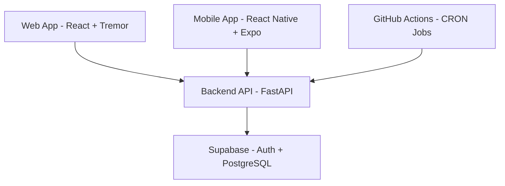
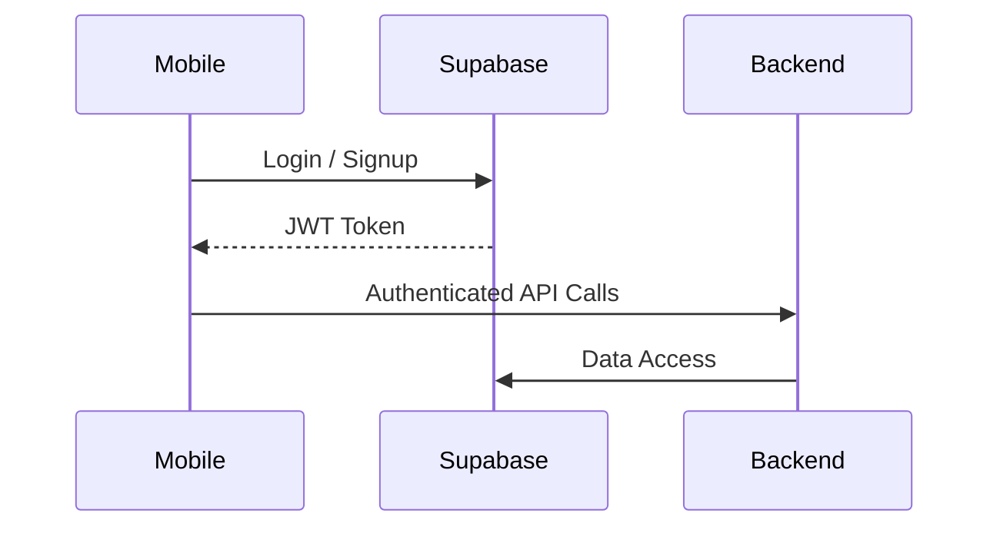

```markdown
# StrideAlytics – Complete System Architecture  
## Version A — Consolidated Blueprint

A comprehensive, multi‑platform, production‑ready architecture blueprint for **StrideAlytics**, covering:

- Web App (React + Tremor)
- Mobile App (React Native + Expo)
- Backend (FastAPI)
- Database (Supabase)Option B — Wrapped in plain triple backticks (``` )
- Authentication (Supabase Auth)
- Schedulers (GitHub Actions)
- Shared Logic (API, Types, Utils)
- Infrastructure (Vercel, Render, Supabase)
- CI/CD
- Full folder structure
- Library breakdown (by layer + by category)
- ASCII + Mermaid diagrams

---

## 1. System Overview

StrideAlytics is a **multi‑platform analytics system** consisting of:

- **Web App:** React + Vite + Tremor + Tailwind + shadcn/ui  
- **Mobile App:** React Native + Expo + NativeWind/Tamagui  
- **Backend API:** FastAPI + Pydantic + Uvicorn  
- **Database:** Supabase PostgreSQL + migrations  
- **Auth:** Supabase Auth (JWT)  
- **Schedulers:** GitHub Actions CRON jobs  
- **Shared Logic:** TypeScript types, shared API client, constants, utils  
- **Infra:** Vercel (web), Render (backend), Supabase (DB/auth), GitHub Actions (CI/CD)

---

## 2. Unified System Diagrams

### 2.1 ASCII Diagram

```
                ┌──────────────────────────────┐
                │        Web App (React)       │
                │  https://stridealytics.vercel│
                └───────────────┬──────────────┘
                                │
                                ▼
                ┌──────────────────────────────┐
                │     Mobile App (Expo RN)     │
                │   iOS / Android / EAS Build  │
                └───────────────┬──────────────┘
                                │
                                ▼
                ┌──────────────────────────────┐
                │     Backend API (FastAPI)    │
                │ https://stridealytics-api... │
                └───────────────┬──────────────┘
                                │
                                ▼
                ┌──────────────────────────────┐
                │   Supabase (Auth + DB + RLS) │
                └───────────────┬──────────────┘
                                │
                                ▼
                ┌──────────────────────────────┐
                │ GitHub Actions (Schedulers)  │
                └──────────────────────────────┘
```

### 2.2 Mermaid Diagram



---

## 3. Full Monorepo Folder Structure

```
stridealytics/
│
├── frontend/                          # Web App (React + Vite + Tremor)
│   ├── src/
│   │   ├── components/
│   │   │   ├── ui/                    # shadcn components
│   │   │   ├── charts/                # Tremor chart wrappers
│   │   │   ├── layout/                # Sidebar, navbar, shell
│   │   │   └── tables/                # Data tables
│   │   ├── pages/
│   │   │   ├── dashboard/
│   │   │   ├── screener/
│   │   │   ├── greeks/
│   │   │   ├── regime/
│   │   │   ├── weekly-picks/
│   │   │   └── trade-log/
│   │   ├── hooks/
│   │   ├── store/                     # Zustand stores
│   │   ├── api/                       # Web API client (shared)
│   │   ├── utils/
│   │   ├── theme/
│   │   └── main.jsx
│   ├── public/
│   ├── index.html
│   ├── package.json
│   └── vite.config.js
│
├── mobile/                            # Mobile App (React Native + Expo)
│   ├── app/                           # Expo Router navigation
│   │   ├── _layout.tsx
│   │   ├── index.tsx                  # Dashboard
│   │   ├── login.tsx
│   │   ├── signup.tsx
│   │   ├── screener/
│   │   ├── greeks/
│   │   ├── regime/
│   │   ├── weekly-picks/
│   │   └── trade-log/
│   ├── components/
│   │   ├── ui/                        # NativeWind/Tamagui components
│   │   ├── charts/                    # Mobile chart wrappers
│   │   └── layout/
│   ├── screens/
│   ├── hooks/
│   ├── store/
│   ├── api/
│   ├── assets/
│   ├── utils/
│   ├── theme/
│   ├── app.json
│   ├── package.json
│   └── tsconfig.json
│
├── backend/                           # FastAPI Backend
│   ├── app/
│   │   ├── main.py
│   │   ├── routers/
│   │   │   ├── auth.py
│   │   │   ├── screener.py
│   │   │   ├── greeks.py
│   │   │   ├── regime.py
│   │   │   ├── weekly_picks.py
│   │   │   └── trades.py
│   │   ├── services/
│   │   │   ├── data_fetcher.py
│   │   │   ├── greeks_engine.py
│   │   │   ├── scoring_engine.py
│   │   │   └── regime_engine.py
│   │   ├── utils/
│   │   │   ├── jwt.py
│   │   │   ├── cache.py
│   │   │   ├── math.py
│   │   │   └── logging.py
│   │   ├── models/
│   │   └── config.py
│   ├── requirements.txt
│   ├── render.yaml
│   └── Dockerfile
│
├── database/                          # Supabase Migrations
│   ├── migrations/
│   │   ├── 001_init.sql
│   │   ├── 002_weekly_picks.sql
│   │   ├── 003_greeks_cache.sql
│   │   ├── 004_regime_scores.sql
│   │   └── 005_trade_log.sql
│   ├── seed/
│   └── README.md
│
├── scheduler/                         # GitHub Actions CRON Jobs
│   ├── workflows/
│   │   ├── screener.yml
│   │   ├── greeks.yml
│   │   ├── regime.yml
│   │   ├── weekly_picks.yml
│   │   └── snapshots.yml
│   └── README.md
│
├── shared/                            # Shared Logic (Web + Mobile + Backend)
│   ├── api/
│   │   ├── client.ts
│   │   ├── endpoints.ts
│   │   └── types.ts
│   ├── constants/
│   │   ├── bands.ts
│   │   ├── api.ts
│   │   └── config.ts
│   ├── schemas/
│   ├── utils/
│   │   ├── formatters.ts
│   │   ├── validators.ts
│   │   └── math.ts
│   └── types/
│       ├── screener.ts
│       ├── greeks.ts
│       ├── regime.ts
│       └── weekly_picks.ts
│
├── infra/
│   ├── vercel.json
│   ├── render.yaml
│   ├── supabase.env.example
│   ├── render.env.example
│   ├── mobile.env.example
│   └── domains.md
│
├── .github/
│   ├── workflows/
│   │   ├── ci.yml
│   │   └── deploy.yml
│
├── .gitignore
├── README.md
└── package.json
```

---

## 4. Web Architecture (Frontend)

- **Framework:** React 18 + Vite  
- **UI:** Tremor, TailwindCSS, shadcn/ui, Lucide Icons  
- **Routing:** React Router  
- **State:** Zustand, React Query  
- **Forms:** React Hook Form (+ Zod optional)  
- **Networking:** Axios  
- **Testing:** Vitest, React Testing Library  
- **Deployment:** Vercel

---

## 5. Mobile Architecture

- **Framework:** React Native + Expo  
- **Navigation:** Expo Router + React Navigation  
- **UI:** NativeWind or Tamagui  
- **State:** Zustand  
- **Server state:** React Query  
- **Networking:** Axios  
- **Charts:** Victory Native or React Native SVG Charts  
- **Auth:** Supabase Auth + SecureStore  
- **Deployment:** Expo EAS

### Mobile Flow Diagrams

```
Mobile App → Supabase Auth → JWT → Backend API → Supabase DB
```



---

## 6. Backend Architecture (FastAPI)

- FastAPI  
- Uvicorn  
- Pydantic v2  
- HTTPX  
- Supabase Python Client  
- Pandas, NumPy, SciPy (optional), TA‑Lib (optional)  
- yfinance  
- JWT verification  
- Redis (optional)  
- pytest  
- Render deployment

---

## 7. Database Architecture (Supabase)

- PostgreSQL  
- SQL migrations  
- Supabase Auth  
- RLS policies  
- Tables: trade_log, weekly_picks, greeks_cache, regime_scores, screener_results, snapshots, tickers_metadata

---

## 8. Auth Architecture

- Supabase Auth  
- JWT flow  
- Secure token storage  
- Backend verification  
- RLS enforcement

---

## 9. Scheduler Architecture

- GitHub Actions  
- CRON jobs  
- curl triggers  
- Screener, Greeks, Regime, Weekly Picks, Snapshots

---

## 10. Shared API Client

- Shared Axios instance  
- Shared endpoints  
- Shared types  
- Token injection  
- Error handling

---

## 11. Mobile UI/UX Plan

- Analytics‑first  
- Dark mode  
- Bottom tabs  
- Screens: Login, Signup, Dashboard, Screener, Greeks, Regime, Weekly Picks, Trade Log  
- Reusable components  
- Chart wrappers  

---

## 12. Library Breakdown by Layer

### Web  
React, Vite, Tremor, Tailwind, shadcn/ui, Zustand, React Query, Axios, Vitest

### Mobile  
React Native, Expo, NativeWind/Tamagui, Zustand, React Query, Axios, Victory Native

### Backend  
FastAPI, Uvicorn, Pydantic, HTTPX, Supabase Python, Pandas, NumPy, SciPy, TA‑Lib

### Database  
Supabase PostgreSQL, Supabase CLI, SQL migrations

### Auth  
Supabase Auth, JWT, python‑jose

### Scheduler  
GitHub Actions, curl, bash

### Shared  
TypeScript, Zod, Axios, utils

### Infra  
Vercel, Render, Supabase, GitHub Actions, Docker

---

## 13. Library Breakdown by Category

### UI  
Tremor, Tailwind, shadcn/ui, NativeWind, Tamagui

### State  
Zustand, React Query

### Networking  
Axios, HTTPX

### Analytics  
Pandas, NumPy, SciPy, TA‑Lib

### Auth  
Supabase Auth, JWT

### DevOps  
Vercel, Render, GitHub Actions, Docker

---

## 14. Final Notes

### Scalability  
- Horizontal backend scaling  
- Supabase handles DB scaling  
- Thin clients  
- Shared logic reduces duplication  

### Future Enhancements  
- More data sources  
- Premium tiers  
- Role‑based access  
- Advanced analytics  
- Push notifications  
- Webhooks  

---

# END OF VERSION A
```
