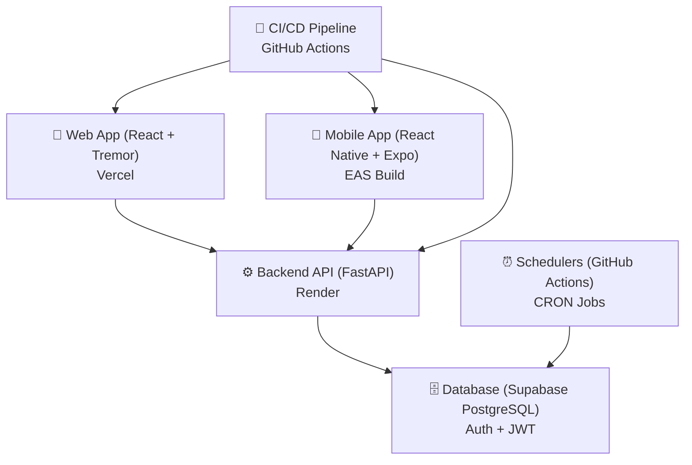

# StrideAlytics — System Diagrams

**Visual representations of system architecture, data flow, and deployment topology**

---

## 1. High-Level System Architecture

### ASCII Diagram

```
┌──────────────────────────────────────────────────────────────────────┐
│                      StrideAlytics System                            │
└──────────────────────────────────────────────────────────────────────┘

                    ┌────────────────┐
                    │  Web App       │
                    │  (Vercel)      │
                    │  React+Tremor  │
                    └────────┬───────┘
                             │
                             │
                    ┌────────┴───────┐
                    │                │
         ┌──────────▼────────┐    ┌──┴──────────────┐
         │   Mobile App      │    │  Backend API   │
         │   (EAS Build)     │    │  (Render)      │
         │ React Native+     │    │  FastAPI       │
         │ Expo             │    │                │
         └──────────────────┘    └────────┬───────┘
                                          │
                                          │
                            ┌─────────────▼────────────┐
                            │   Supabase              │
                            │   Database + Auth      │
                            │   PostgreSQL + JWT     │
                            └─────────────┬───────────┘
                                          │
                                          │
                            ┌─────────────▼────────────┐
                            │  GitHub Actions         │
                            │  Schedulers (CRON)      │
                            └────────────────────────┘
```

### Mermaid Diagram



---

## 2. Request/Response Flow

### User Interaction Flow (Detailed)

```
┌──────────────────────────────────────────────────────────────────┐
│                     User Request Flow                           │
└──────────────────────────────────────────────────────────────────┘

1. USER INITIATES REQUEST
   Web/Mobile App (UI Component)
   └─ User clicks, submits form, refreshes page
   
2. CLIENT-SIDE PROCESSING
   React Component / State Management (Zustand)
   └─ Build request payload
   └─ Add authentication token
   
3. NETWORK REQUEST
   Axios / React Query
   └─ HTTP request to Backend API
   └─ Endpoint: /api/v1/screener, /api/v1/greeks, etc.
   
4. BACKEND PROCESSING
   FastAPI Router
   └─ Route to handler
   └─ Validate input (Pydantic)
   └─ Check authentication (JWT)
   
5. BUSINESS LOGIC
   FastAPI Services
   └─ Process data
   └─ Call external APIs (yfinance)
   └─ Run calculations
   
6. DATABASE QUERY
   Supabase PostgreSQL
   └─ Execute SQL query
   └─ Apply RLS policies
   └─ Return data
   
7. RESPONSE CONSTRUCTION
   FastAPI Response
   └─ Serialize data (JSON)
   └─ Add pagination headers
   └─ Return to client
   
8. RESPONSE HANDLING
   React Query / Zustand
   └─ Cache response
   └─ Update component state
   
9. UI UPDATE
   React Component
   └─ Re-render with new data
   └─ Display to user
```

---

## 3. Data Flow Diagram

```
┌────────────────────────────────────────────────────────────┐
│                  Data Flow Architecture                   │
└────────────────────────────────────────────────────────────┘

EXTERNAL DATA SOURCES
    │
    ├─ yfinance (Market data)
    ├─ Options data APIs
    └─ Market feeds
        │
        ▼
┌──────────────────────────────────────────┐
│ GitHub Actions (Scheduled Tasks)         │
│  - Fetch data from external APIs         │
│  - Run calculations                      │
│  - Process & normalize data              │
└──────────────────────────────────────────┘
        │
        ▼
┌──────────────────────────────────────────┐
│ Backend Service Layer                    │
│  - Aggregate data                        │
│  - Apply business logic                  │
│  - Cache results                         │
└──────────────────────────────────────────┘
        │
        ▼
┌──────────────────────────────────────────┐
│ Database (Supabase PostgreSQL)           │
│  - Store processed data                  │
│  - Apply security (RLS)                  │
│  - Version management                    │
└──────────────────────────────────────────┘
        │
        ├─────────────────────────────┬──────────────────┐
        ▼                             ▼                  ▼
    Web App                       Mobile App         Backend API
    (React)                    (React Native)     (Scheduled Tasks)
        │                             │                  │
        └─────────────────────────────┴──────────────────┘
                        │
                        ▼
                    User Dashboard
```

---

## 4. Component Interaction Diagram

```
┌─────────────────────────────────────────────────────────┐
│            Frontend Component Architecture              │
└─────────────────────────────────────────────────────────┘

User Interface Layer
├─ Pages (Dashboard, Screener, Greeks, Regime, Picks, TradeLog)
│
Components Layer
├─ UI Components (Buttons, Cards, Modals, Tables)
├─ Chart Components (Tremor Charts, Custom Visualizations)
├─ Layout Components (Sidebar, Navbar, Shell)
│
State Management Layer (Zustand Stores)
├─ auth.store → User, JWT token, permissions
├─ screener.store → Filters, results, pagination
├─ greeks.store → Options data, calculations
├─ ui.store → Modal states, notifications
│
API Client Layer (Axios + React Query)
├─ Query hooks → Fetch operations
├─ Mutation hooks → Update operations
├─ Cache management
│
Network Layer
└─ REST API (Backend)
```

---

## 5. Database Schema Relationships (Simplified)

```
┌──────────────────────────────────────────────────────────┐
│             Supabase Database Structure                  │
└──────────────────────────────────────────────────────────┘

┌──────────────┐
│    users     │
├──────────────┤
│ id (PK)      │◄──────────┐
│ email        │           │
│ name         │           │
│ created_at   │           │
└──────────────┘           │
                           │
                    ┌──────┴──────┐
                    │             │
            ┌───────▼──────┐  ┌──┴────────┐
            │ portfolios   │  │ trade_log │
            ├──────────────┤  ├───────────┤
            │ id (PK)      │  │ id (PK)   │
            │ user_id (FK) │◄─┤ user_id   │
            │ name         │  │ symbol    │
            │ created_at   │  │ entry     │
            └──────────────┘  │ exit      │
                             │ created_at│
                             └───────────┘

            ┌──────────────┐
            │   options    │
            ├──────────────┤
            │ id (PK)      │
            │ symbol       │
            │ strike       │
            │ expiry       │
            │ greeks_data  │
            │ updated_at   │
            └──────────────┘
```

---

## 6. Deployment Architecture

### Infrastructure Topology

```
┌──────────────────────────────────────────────────────────────┐
│                  Deployment Infrastructure                  │
└──────────────────────────────────────────────────────────────┘

INTERNET
    │
    ├─────────────────────────────────────────┬────────────────┐
    ▼                                         ▼                ▼
┌─────────────────┐              ┌──────────────────┐   ┌──────────┐
│  Vercel CDN     │              │  Render.com      │   │ Supabase │
│  (Web App)      │              │  (Backend API)   │   │ (Postgres│
│                 │              │                  │   │  + Auth) │
│ - Global Edge   │              │ - Python Runtime │   │          │
│ - Auto-scaling  │              │ - FastAPI Server │   │ - Cloud  │
│ - SSL/TLS       │              │ - Auto-scaling   │   │ - RLS    │
└────────┬────────┘              └────────┬─────────┘   │ - Backup │
         │                               │              └──────────┘
         └───────────────┬───────────────┘
                         │
                    API Calls
                    (HTTPS/JWT)

┌─────────────────────────────────────────────────────────┐
│         Mobile Apps (Expo EAS Build)                   │
├─────────────────────────────────────────────────────────┤
│ - iOS App Store / Google Play Store                    │
│ - Push notification services                          │
│ - Crash reporting                                     │
└─────────────────────────────────────────────────────────┘

┌─────────────────────────────────────────────────────────┐
│         GitHub Runners (CI/CD + Schedulers)            │
├─────────────────────────────────────────────────────────┤
│ - Build & test workflows                              │
│ - Deploy to Vercel / Render                           │
│ - Scheduled CRON jobs                                 │
└─────────────────────────────────────────────────────────┘
```

---

## 7. CI/CD Pipeline Flow

```
┌────────────────────────────────────────────────────────────┐
│              CI/CD Pipeline Workflow                       │
└────────────────────────────────────────────────────────────┘

Developer Push to GitHub
    │
    ▼
GitHub Actions Triggered
    │
    ├─ LINT & FORMAT
    │  ├─ ESLint (Frontend/Mobile)
    │  ├─ Prettier
    │  └─ Pylint (Backend)
    │
    ├─ UNIT TESTS
    │  ├─ Frontend: Vitest + React Testing Library
    │  ├─ Mobile: Jest
    │  └─ Backend: pytest
    │
    ├─ BUILD
    │  ├─ Frontend: npm run build
    │  ├─ Mobile: EAS build
    │  └─ Backend: Docker build
    │
    ├─ DEPLOY (if tests pass)
    │  ├─ Frontend → Vercel
    │  ├─ Backend → Render
    │  ├─ Database → Migrations
    │  └─ Mobile → EAS (TestFlight/Internal)
    │
    └─ PRODUCTION (on release)
       └─ Manual approval
          ├─ Frontend → Vercel (production)
          ├─ Backend → Render (production)
          └─ Mobile → App Stores

All deployed ✅
```

---

## 8. Authentication & Authorization Flow

```
┌──────────────────────────────────────────────────────────┐
│           Auth & Authorization Flow                     │
└──────────────────────────────────────────────────────────┘

1. LOGIN
   User enters credentials (email/password)
        ▼
   Frontend sends to Backend
        ▼
   Backend calls Supabase Auth API
        ▼
   Supabase returns JWT token + refresh token
        ▼
   Frontend stores JWT (localStorage/secureStore)

2. API REQUEST
   Frontend includes JWT in Authorization header
        ▼
   Backend validates JWT signature
        ▼
   Backend extracts user_id from JWT
        ▼
   Backend queries pass user_id to database

3. DATABASE ACCESS
   Supabase applies RLS policies
        ▼
   Policy check: user_id matches row user_id
        ▼
   Row is returned or denied
        ▼
   Backend returns authorized data to frontend

4. REFRESH
   When JWT expires
        ▼
   Frontend uses refresh token to get new JWT
        ▼
   Supabase issues new JWT
        ▼
   Frontend stores new JWT, continues operation
```

---

## 9. Error Handling & Monitoring

```
┌─────────────────────────────────────────────────────┐
│         Error Handling Architecture                │
└─────────────────────────────────────────────────────┘

Frontend Error
    ▼
Error Boundary / Try-Catch
    ▼
Log to console / Sentry (optional)
    ▼
Show user-friendly message
    ▼
Retry or fallback option

Backend Error
    ▼
FastAPI exception handler
    ▼
Log to structlog / CloudWatch
    ▼
Return JSON error response
    ▼
Frontend receives error code
    ▼
Display in UI

Database Error
    ▼
Supabase returns error
    ▼
Backend catches & transforms
    ▼
Returns 4xx/5xx status
    ▼
Frontend handles appropriately
```

---

## 10. Scaling Scenario

```
┌──────────────────────────────────────────────────────────┐
│              High-Traffic Scaling                       │
└──────────────────────────────────────────────────────────┘

Normal Load                 High Load
─────────────────────────────────────────────
Vercel 1 instance    →     Vercel auto-scale
Render 1 dyno        →     Render auto-scale
Database pool: 50    →     Database pool: 200
Redis: None          →     Redis cluster
CDN cache: Standard  →     CDN cache: Aggressive
API rate: Unlimited  →     API rate: Throttled

Bottleneck Analysis:
1. Database connections → Increase pool size
2. API response time → Add Redis caching
3. Frontend load → Verify CDN caching
4. Mobile app → Paginate data, lazy load
```

---

## Next Steps

- **See Folder Structure?** → [03-FOLDER-STRUCTURE](./03-FOLDER-STRUCTURE.md)
- **Understand Layers?** → [LAYERS/](./LAYERS/)
- **Deployment Details?** → [06-DEPLOYMENT-LAYER](./LAYERS/06-DEPLOYMENT-LAYER.md)
- **CI/CD Details?** → [07-CI-CD-LAYER](./LAYERS/07-CI-CD-LAYER.md)

---

**Version:** A | **Last Updated:** 2026-06-15
